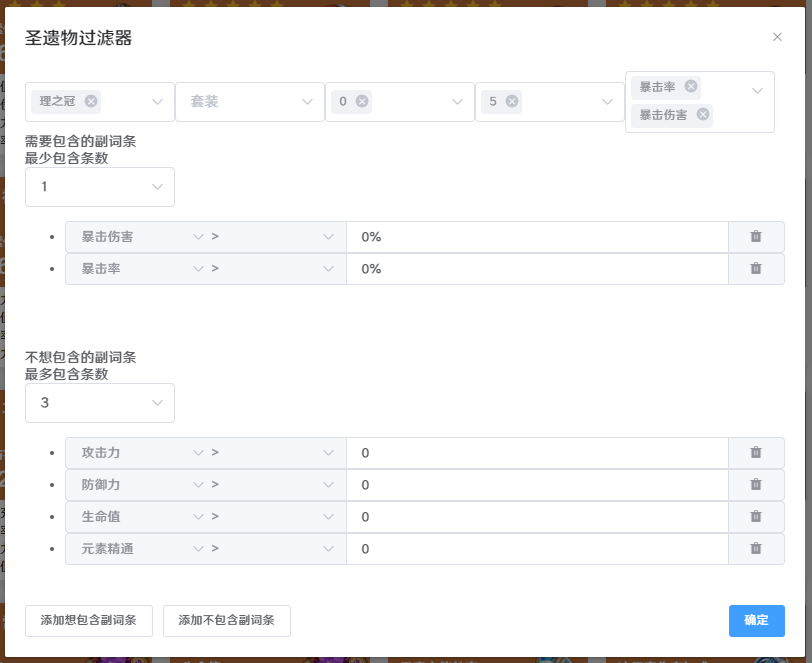

# 天目流椰羊AmenomaCocogoat

一个缝合怪，拼接了[天目Amenoma](https://github.com/daydreaming666/Amenoma)和[椰羊cocogoat](https://github.com/YuehaiTeam/cocogoat-client)，用于对原神圣遗物识别、过滤和部分加锁解锁。

---

Amenoma相关代码基于GPLv3开源，cocogoat和该整合工具相关代码基于MIT开源。作者不会对使用该工具产生的任何后果负责。

## 暂停维护通知

该项目已暂停维护，v0.3.3基于原神2.5版本的功能仍可使用，将来游戏新增圣遗物后新圣遗物将无法识别/识别错误。

在v0.3.4版本中cocogoat加入了过滤规则导入导出和批量执行过滤规则的功能，由于打算暂停维护暂未很好测试，不排除还有BUG。

由于目前已经有了更好用的圣遗物相关工具，作者已经把过滤规则面板移植到
[tseflcz/artifact-master](https://github.com/tseflcz/artifacts-master)中，
同时换用[yas](https://github.com/wormtql/yas)和[yas-lock](https://github.com/ideless/yas-lock)作为扫描和加锁工具。
上述工具具有更小的体积、更快的速度，实在是太香了，故暂停维护该仓库。

“由于这个工具太方便了，作者已经跑去用这个工具了，本仓库暂停更新”

## 功能

- 基于Amenoma的圣遗物自动识别
- 基于Cocogoat的圣遗物展示、过滤
- 基于Amenoma的圣遗物自动加锁解锁
- 圣遗物基于识别结果进行过滤和同步，因此可以使用游戏内筛选对圣遗物增量更新和自动加锁解锁

## 简易流程

- 使用Amenoma扫描圣遗物。操作与原版相同，使用窗口模式运行原神，进入圣遗物界面，管理员权限启动Amenoma，点击开始扫描等待结束。
- 打开Cocogoat，点击上部过滤按钮，填写过滤逻辑并点击确定。
- 选中上方操作按钮，在下拉菜单中点击全部选择，然后加锁已选/解锁已选。
- 如果有多种过滤操作，点击取消过滤并设定新过滤条件。
- 在原神中加锁任意圣遗物，如果有圣遗物已加锁提示弹出，选择不再提示。
- 关闭Cocogoat，回到Amenoma，选择"将圣遗物锁同步至游戏"选项，进入圣遗物界面并滚动到最开始，点击开始扫描等待加锁解锁。

## 详细流程

- 使用Amenoma扫描圣遗物。操作与原版相同，使用窗口模式运行原神，进入圣遗物界面，管理员权限启动Amenoma，点击开始扫描等待结束。
- 使用Cocogoat展示处理圣遗物数据。打开Cocogoat，如果已经打开请点击左上角更新圣遗物信息。**未更新前在Cocogoat对圣遗物进行任何操作会导致Amenoma生成的数据被覆盖，请务必更新后操作或运行完毕Amenoma后再打开Cocogoat。** Cocogoat和原版相比是增量更新，包括原版所有功能。圣遗物界面按钮包括：
  - 更新圣遗物信息：重新读取圣遗物数据，未关闭Cocogoat的情况下运行Amenoma后必选
  - 导出：和Cocogoat相同，可导出莫娜占卜铺、原魔计算器、GOOD数据
  - 操作：下拉菜单包含：全部选择、全部不选、加锁已选、解锁已选。其中在过滤状态下全选只会选中过滤出的圣遗物
  - 过滤：点击展开过滤界面。可设置过滤圣遗物的部位、套装、等级、星级、主词条、副词条，支持多选。关于过滤逻辑见下
  - 添加：原版功能，添加一个新的圣遗物
  - 清空/删除选中：清空所有圣遗物/删除选中圣遗物
  - 识别：Cocogoat的OCR识别，使用识别框，同样支持自动加锁解锁，但是识别速度和准确率比Amenoma略低，不想两个工具切换可以用此
  - 圣遗物：每个圣遗物包含三种操作
    - 右上...：编辑圣遗物，在圣遗物识别出错时可以修改。**由于新增、加锁、解锁均通过OCR识别决定，即使识别错误，修改了圣遗物数据会导致无法和识别结果匹配，如果用于加锁解锁请勿修改圣遗物数据。**
    - 右下锁标记：更改圣遗物锁状态，锁定圣遗物或解锁圣遗物。状态会实时更新到存储文件中，供Amenoma自动加锁解锁
    - 其他位置：点击后即选择/不选择该圣遗物
- 在Cocogoat中调整圣遗物加锁解锁状态后，回到Amenoma，将"获取游戏锁状态并保存"换为"将圣遗物锁同步至游戏"。**进入游戏圣遗物界面，加锁解锁任意圣遗物。如果出现已锁定此装备的弹窗提示，勾选不再提示并关闭弹窗。** 点击开始扫描等待结束。

## 过滤逻辑

过滤界面如下：



其中部位、套装、等级、星级、主词条为复选菜单，不选时不使用该数据过滤，选择后过滤满足所选项的圣遗物。

对于副词条，有想包含的副词条和不想包含的副词条两种。如果留空则不用于过滤。以想包含的副词条为例：

- 最少包含条数：最少包含多少条所列的副词条。例如选择了攻充爆爆最少条数3，那么这四条中至少包含三条的圣遗物才会被过滤出来
- 添加想包含副词条：按钮位于窗口最下方，点击后添加新的一个副词条筛选数据
- 副词条：包含四部分，副词条名称、判断方式、数值、删除。名称选择副词条名，判断方式有`> < =`等，数值为数值阈值，删除为删除该副词条。**这里名称中的攻击力、防御力、生命值同时指代百分比数据和数字数据，并通过数值栏有无百分号区分。** 例如只想选攻击力百分比，数值需要输入`x%`；想同时包含防御力和防御力百分比，需要写两条`防御力 > 0, 防御力 > 0%`。

不想包含的副词条和上述类似，不同在于：最多包含条数，圣遗物副词条最多只能包含多少条不想包含的副词条。添加不包含副词条，添加新的一条不想包含的副词条。

点击确定应用过滤，界面将只展示过滤出的圣遗物，同时过滤按钮变为取消过滤，点击后重新展示所有圣遗物。

## 批量过滤

支持规则的导入导出，以及可以使用多个规则依次执行，从而只需要存好批量规则避免了每次都要重设规则的烦恼。

首先使用过滤规则编写规则，并导出规则，规则会以JSON格式存储于剪贴板。
然后在顶部有批量过滤按钮，批量过滤面板中新增一条规则并将导出的规则贴于下方文本框。
同时在规则左侧有选择该规则过滤出圣遗物是全部加锁还是全部解锁按钮。
批量规则也支持数据的导入导出。这里给出一些我自用的批量规则数据。

### 普通的批量垃圾

```JSON
[{"comment":"全部先加锁","filterjson":"{\"main\":[],\"stars\":[],\"level\":[],\"name\":[],\"set\":[],\"position\":[],\"subCount\":[],\"includeSub\":[],\"includeSubCount\":0,\"excludeSub\":[],\"excludeSubCount\":0}","lock":true},{"comment":"非羽毛主攻击无爆","filterjson":"{\"main\":[\"攻击力\"],\"stars\":[],\"level\":[],\"name\":[],\"set\":[],\"position\":[\"时之沙\",\"空之杯\",\"理之冠\"],\"subCount\":[4],\"includeSub\":[],\"includeSubCount\":0,\"excludeSub\":[{\"name\":\"暴击率\",\"value\":\"0%\",\"equation\":2},{\"name\":\"暴击伤害\",\"value\":\"0%\",\"equation\":2}],\"excludeSubCount\":0}","lock":false},{"comment":"花羽，小字大三围共四条（大三围冲突，剩下小字，基本只有一条有效）","filterjson":"{\"main\":[],\"stars\":[],\"level\":[],\"name\":[],\"set\":[],\"position\":[\"生之花\",\"死之羽\"],\"subCount\":[],\"includeSub\":[{\"name\":\"攻击力\",\"value\":\"0\",\"equation\":2},{\"name\":\"防御力\",\"value\":\"0\",\"equation\":2},{\"name\":\"生命值\",\"value\":\"0\",\"equation\":2},{\"name\":\"攻击力\",\"value\":\"0%\",\"equation\":2},{\"name\":\"防御力\",\"value\":\"0%\",\"equation\":2},{\"name\":\"生命值\",\"value\":\"0%\",\"equation\":2}],\"includeSubCount\":4,\"excludeSub\":[],\"excludeSubCount\":0}","lock":false},{"comment":"三条三维小字","filterjson":"{\"main\":[],\"stars\":[],\"level\":[],\"name\":[],\"set\":[],\"position\":[],\"subCount\":[],\"includeSub\":[{\"name\":\"攻击力\",\"value\":\"0\",\"equation\":2},{\"name\":\"防御力\",\"value\":\"0\",\"equation\":2},{\"name\":\"生命值\",\"value\":\"0\",\"equation\":2}],\"includeSubCount\":3,\"excludeSub\":[],\"excludeSubCount\":0}","lock":false},{"comment":"主词条是三维，副词条有三条以上的三维小字或三维百分比","filterjson":"{\"main\":[\"攻击力\"],\"stars\":[],\"level\":[0],\"name\":[],\"set\":[],\"position\":[\"时之沙\",\"空之杯\",\"理之冠\"],\"subCount\":[],\"includeSub\":[{\"name\":\"攻击力\",\"value\":\"0\",\"equation\":2},{\"name\":\"防御力\",\"value\":\"0\",\"equation\":2},{\"name\":\"生命值\",\"value\":\"0\",\"equation\":2},{\"name\":\"生命值\",\"value\":\"0%\",\"equation\":2},{\"name\":\"防御力\",\"value\":\"0%\",\"equation\":2}],\"includeSubCount\":3,\"excludeSub\":[],\"excludeSubCount\":0}","lock":false},{"comment":"主词条是三维，副词条有三条以上的三维小字或三维百分比","filterjson":"{\"main\":[\"防御力\"],\"stars\":[],\"level\":[0],\"name\":[],\"set\":[],\"position\":[\"时之沙\",\"空之杯\",\"理之冠\"],\"subCount\":[],\"includeSub\":[{\"name\":\"攻击力\",\"value\":\"0\",\"equation\":2},{\"name\":\"防御力\",\"value\":\"0\",\"equation\":2},{\"name\":\"生命值\",\"value\":\"0\",\"equation\":2},{\"name\":\"生命值\",\"value\":\"0%\",\"equation\":2},{\"name\":\"攻击力\",\"value\":\"0%\",\"equation\":2}],\"includeSubCount\":3,\"excludeSub\":[],\"excludeSubCount\":0}","lock":false},{"comment":"主词条是三维，副词条有三条以上的三维小字或三维百分比","filterjson":"{\"main\":[\"生命值\"],\"stars\":[],\"level\":[0],\"name\":[],\"set\":[],\"position\":[\"时之沙\",\"空之杯\",\"理之冠\"],\"subCount\":[],\"includeSub\":[{\"name\":\"攻击力\",\"value\":\"0\",\"equation\":2},{\"name\":\"防御力\",\"value\":\"0\",\"equation\":2},{\"name\":\"生命值\",\"value\":\"0\",\"equation\":2},{\"name\":\"防御力\",\"value\":\"0%\",\"equation\":2},{\"name\":\"攻击力\",\"value\":\"0%\",\"equation\":2}],\"includeSubCount\":3,\"excludeSub\":[],\"excludeSubCount\":0}","lock":false},{"comment":"对于花羽，4条，没有双爆且两条小字","filterjson":"{\"main\":[],\"stars\":[],\"level\":[],\"name\":[],\"set\":[],\"position\":[\"生之花\",\"死之羽\"],\"subCount\":[4],\"includeSub\":[{\"name\":\"攻击力\",\"value\":\"0\",\"equation\":2},{\"name\":\"防御力\",\"value\":\"0\",\"equation\":2},{\"name\":\"生命值\",\"value\":\"0\",\"equation\":2}],\"includeSubCount\":2,\"excludeSub\":[{\"name\":\"暴击率\",\"value\":\"0%\",\"equation\":2},{\"name\":\"暴击伤害\",\"value\":\"0%\",\"equation\":2}],\"excludeSubCount\":0}","lock":false},{"comment":"所有元素杯，暴头，治疗头，充能沙，精通件","filterjson":"{\"main\":[\"暴击率\",\"暴击伤害\",\"元素精通\",\"元素充能效率\",\"物理伤害加成\",\"治疗加成\",\"岩元素伤害加成\",\"风元素伤害加成\",\"冰元素伤害加成\",\"水元素伤害加成\",\"雷元素伤害加成\",\"火元素伤害加成\"],\"stars\":[],\"level\":[],\"name\":[],\"set\":[],\"position\":[],\"subCount\":[],\"includeSub\":[],\"includeSubCount\":0,\"excludeSub\":[],\"excludeSubCount\":0}","lock":true},{"comment":"12级往上的","filterjson":"{\"main\":[],\"stars\":[],\"level\":[20,19,17,18,13,16,15,14,12],\"name\":[],\"set\":[],\"position\":[],\"subCount\":[],\"includeSub\":[],\"includeSubCount\":0,\"excludeSub\":[],\"excludeSubCount\":0}","lock":true}]
```

### 针对角斗乐团的花羽筛选

```JSON
[{"comment":"4条角斗花羽不到3条攻充爆爆","filterjson":"{\"main\":[],\"stars\":[],\"level\":[],\"name\":[],\"set\":[\"角斗士的终幕礼\"],\"position\":[\"生之花\",\"死之羽\"],\"subCount\":[4],\"includeSub\":[],\"includeSubCount\":0,\"excludeSub\":[{\"name\":\"暴击率\",\"value\":\"0%\",\"equation\":2},{\"name\":\"暴击伤害\",\"value\":\"0%\",\"equation\":2},{\"name\":\"元素充能效率\",\"value\":\"0%\",\"equation\":2},{\"name\":\"攻击力\",\"value\":\"0%\",\"equation\":2}],\"excludeSubCount\":2}","lock":false},{"comment":"3条角斗花羽不到2条攻充爆爆","filterjson":"{\"main\":[],\"stars\":[],\"level\":[],\"name\":[],\"set\":[\"角斗士的终幕礼\"],\"position\":[\"生之花\",\"死之羽\"],\"subCount\":[3],\"includeSub\":[],\"includeSubCount\":0,\"excludeSub\":[{\"name\":\"暴击率\",\"value\":\"0%\",\"equation\":2},{\"name\":\"暴击伤害\",\"value\":\"0%\",\"equation\":2},{\"name\":\"元素充能效率\",\"value\":\"0%\",\"equation\":2},{\"name\":\"攻击力\",\"value\":\"0%\",\"equation\":2}],\"excludeSubCount\":1}","lock":false},{"comment":"4条乐团花羽不到3条攻充爆爆精","filterjson":"{\"main\":[],\"stars\":[],\"level\":[],\"name\":[],\"set\":[\"流浪大地的乐团\"],\"position\":[\"生之花\",\"死之羽\"],\"subCount\":[4],\"includeSub\":[],\"includeSubCount\":0,\"excludeSub\":[{\"name\":\"暴击率\",\"value\":\"0%\",\"equation\":2},{\"name\":\"暴击伤害\",\"value\":\"0%\",\"equation\":2},{\"name\":\"元素充能效率\",\"value\":\"0%\",\"equation\":2},{\"name\":\"攻击力\",\"value\":\"0%\",\"equation\":2},{\"name\":\"元素精通\",\"value\":\"0\",\"equation\":2}],\"excludeSubCount\":2}","lock":false},{"comment":"3条乐团花羽不到2条攻充爆爆精","filterjson":"{\"main\":[],\"stars\":[],\"level\":[],\"name\":[],\"set\":[\"流浪大地的乐团\"],\"position\":[\"生之花\",\"死之羽\"],\"subCount\":[3],\"includeSub\":[],\"includeSubCount\":0,\"excludeSub\":[{\"name\":\"暴击率\",\"value\":\"0%\",\"equation\":2},{\"name\":\"暴击伤害\",\"value\":\"0%\",\"equation\":2},{\"name\":\"元素充能效率\",\"value\":\"0%\",\"equation\":2},{\"name\":\"攻击力\",\"value\":\"0%\",\"equation\":2},{\"name\":\"元素精通\",\"value\":\"0\",\"equation\":2}],\"excludeSubCount\":1}","lock":false},{"comment":"加锁红蓝花羽双爆的","filterjson":"{\"main\":[],\"stars\":[],\"level\":[],\"name\":[],\"set\":[\"角斗士的终幕礼\",\"流浪大地的乐团\"],\"position\":[\"生之花\",\"死之羽\"],\"subCount\":[],\"includeSub\":[{\"name\":\"暴击率\",\"value\":\"0%\",\"equation\":2},{\"name\":\"暴击伤害\",\"value\":\"0%\",\"equation\":2}],\"includeSubCount\":2,\"excludeSub\":[],\"excludeSubCount\":0}","lock":true}]
```

## 开发

Amenoma和Cocogoat完全独立，均基于原版配置二次开发。二次开发代码分支为[Amenoma:lock](https://github.com/zyr17/Amenoma/tree/lock)和[cocogoat:feat/artifact-lock](https://github.com/zyr17/cocogoat/tree/feat/artifact-lock)。

## 存在问题和待改进

- 由于需要识别圣遗物后才能决定是否加锁解锁，魔改版Amenoma相比原版扫描速度降为约二分之一
- 目前不会保存过滤配置，每次启动需要手动重新输入
- 未支持中文以外的语言
